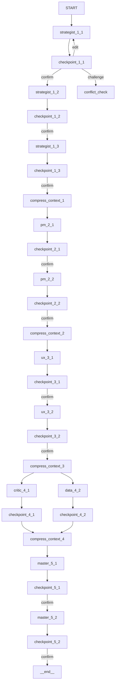
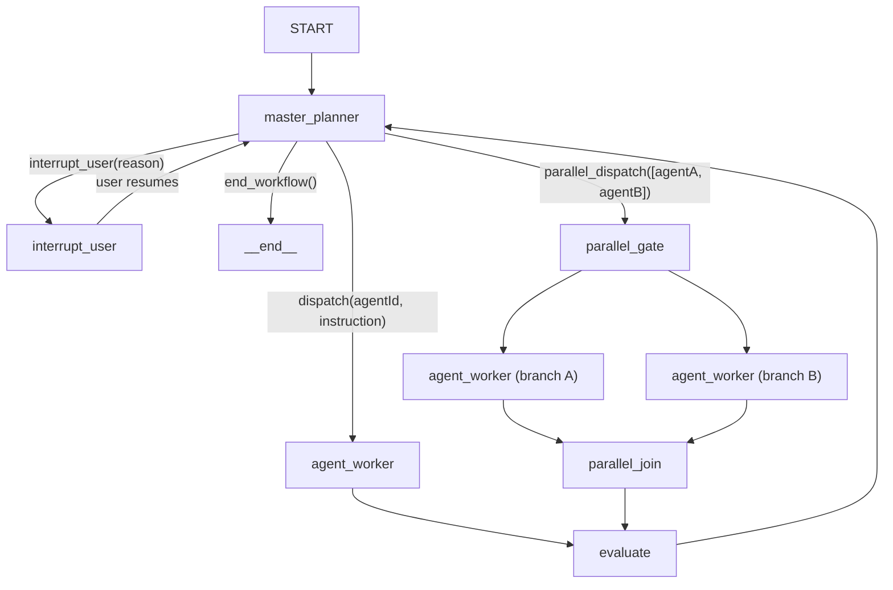
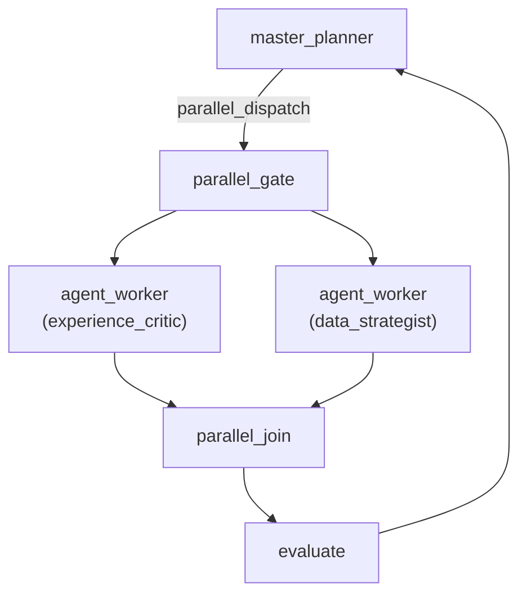

# Master Agent Supervisor 架构重构计划

> **文档状态**：Draft v1.0 | 日期：2026-03-18
> **作者**：Architecture Review
> **基于**：HiveMind多Agent系统设计规格_v2.3 + 当前代码库分析

---

## 一、目标与终态

### 1.1 Done Criteria（完成标准）

| # | 验收标准 | 验证方法 |
|---|---------|---------|
| DC-1 | Master LLM 动态决定下一步调度谁（agent / interrupt / end），不再依赖 `addEdge` 硬编码 | 删除 `graph.ts` 中所有 `addEdge(stepA, stepB)` 静态边；路由由 `master_planner` 的 structured output 决定 |
| DC-2 | Chat 模式和 Workflow 模式统一为一条代码路径 | `llm.ts` 中的 `handleLLMStream` 仅作为未绑定 workflow 时的简单对话入口；所有 workflow 对话走同一个 StateGraph |
| DC-3 | "启动引导式工作流"按钮 = 给 Master 发一条预设 HumanMessage | `plan-panel.tsx` 的 `startWorkflow()` 不再调用 `WORKFLOW_V2_START` IPC，而是向 Master 对话发送 `"请启动引导式工作流"` |
| DC-4 | 保留现有多轮对话、工具调用、artifact 产出能力 | 所有现有 agent subgraph 功能（save_artifact, read_file, web_search, interrupt_wait_user）不变 |
| DC-5 | Phase 4 并行执行仍然可用 | `master_planner` 可发出 `parallel_dispatch` 指令同时调度 experience_critic 和 data_strategist |
| DC-6 | 所有 Agent prompt 使用英文 | Master planner system prompt、agent worker instructions 均为英文 |
| DC-7 | 向后兼容：前端 `plan-panel` 仍能显示 Phase/Step 进度 | `SupervisorState.plan` 包含结构化的步骤列表，前端可直接映射 |

### 1.2 Non-goals（不做什么）

| # | 明确不做 | 原因 |
|---|---------|------|
| NG-1 | 不重写 agent-subgraph.ts 内部逻辑 | 它是经过验证的多轮对话引擎，复用即可 |
| NG-2 | 不引入新的 Agent 角色 | 团队结构不变（6 个 Agent） |
| NG-3 | 不修改 Agent YAML 定义 | persona/optimize_for/avoid/critique_scope 保持不变 |
| NG-4 | 不实现自动回溯（auto-rollback） | 回溯仍需用户确认 |
| NG-5 | 不移除 conflict-check 机制 | 冲突检测保留，但触发方式改为 Master 判断 |
| NG-6 | 不实现用户偏好权重自动调整 | Epic 7 范围 |

---

## 二、Supervisor 图拓扑设计

### 2.1 当前架构（静态 DAG）



**问题**：
- 11 个 step 节点 + 11 个 checkpoint 节点 + 4 个 compress 节点 = 26 个节点硬编码
- Master 无编排能力，只在 Phase 5 才出现
- 边数固定，跳步/动态调度不可能
- Chat 和 Workflow 是两条完全独立的代码路径（`llm.ts` vs `runner.ts`）

### 2.2 目标架构（Supervisor 模式）



### 2.3 节点定义

| 节点名 | 类型 | 职责 | 实现方式 |
|--------|------|------|---------|
| `master_planner` | LLM 决策节点 | 分析当前 state，决定下一步行动 | Structured output → `SupervisorDecision` |
| `agent_worker` | 子图执行节点 | 执行具体 Agent 的多轮对话 | 复用现有 `createAgentSubgraph()` |
| `evaluate` | 确定性节点 | 评估 agent 产出，更新 plan 状态 | 纯代码：检查 artifact 是否产出、更新 completedSteps |
| `interrupt_user` | 中断节点 | 暂停等待用户确认 | `interrupt()` + 解析 `UserDecision` |
| `parallel_gate` | 确定性扇出节点 | 同时调度多个 agent | 返回 `Command` 数组 |
| `parallel_join` | 确定性扇入节点 | 等待所有并行分支完成 | Barrier edge（复用现有模式） |
| `compress_context` | 确定性节点 | Phase 交接时压缩上下文 | 复用现有 `createCompressContextNode()` |

### 2.4 边和条件路由

```typescript
// 伪代码：Supervisor 图构建
const builder = new StateGraph(SupervisorState)

// 核心节点
builder.addNode('master_planner', masterPlannerNode)
builder.addNode('agent_worker', agentWorkerNode, { ends: [...allAgentNodeIds] })
builder.addNode('evaluate', evaluateNode)
builder.addNode('interrupt_user', interruptUserNode)
builder.addNode('compress_context', compressContextNode)

// 条件路由：master_planner 的输出决定下一步
builder.addConditionalEdges('master_planner', routeMasterDecision, {
  'dispatch': 'agent_worker',
  'interrupt_user': 'interrupt_user',
  'compress_context': 'compress_context',
  'end': END,
})

// 固定边
builder.addEdge(START, 'master_planner')
builder.addEdge('agent_worker', 'evaluate')
builder.addEdge('evaluate', 'master_planner')
builder.addEdge('interrupt_user', 'master_planner')
builder.addEdge('compress_context', 'master_planner')
```

### 2.5 Phase 4 并行处理方案

Phase 4 的 experience_critic 和 data_strategist 需要并行执行。在 Supervisor 架构下：



**实现方式**：
1. `master_planner` 输出 `{ action: 'parallel_dispatch', agents: ['experience_critic', 'data_strategist'] }`
2. `parallel_gate` 节点为每个 agent 创建独立的 `agent_worker` 子图实例
3. 使用 LangGraph 的 barrier edge `addEdge([branch_a, branch_b], 'parallel_join')` 实现扇入
4. `parallel_join` 收集两个分支的产出后传给 `evaluate`

**降级方案**：如果 LangGraph 的动态并行分支实现过于复杂，可退化为串行执行（master_planner 先调度 experience_critic，完成后再调度 data_strategist），后续迭代优化。

---

## 三、State Schema 设计

### 3.1 新的 SupervisorState

```typescript
import { Annotation, messagesStateReducer } from '@langchain/langgraph'
import type { BaseMessage } from '@langchain/core/messages'

// ─── New Types ─────────────────────────────────────────

/** Master planner's decision output */
export interface SupervisorDecision {
  action: 'dispatch' | 'interrupt_user' | 'parallel_dispatch' | 'compress_context' | 'end'
  /** Target agent ID (for dispatch) */
  agentId?: string
  /** Multiple agent IDs (for parallel_dispatch) */
  agentIds?: string[]
  /** Step-specific instruction injected into agent system prompt */
  instruction?: string
  /** Expected artifact filename */
  expectedArtifact?: string | null
  /** Upstream artifact filenames for context */
  upstreamArtifacts?: string[]
  /** Reason for interrupting user */
  interruptReason?: string
  /** Phase transition target (for compress_context) */
  targetPhase?: number
  /** Mode: which Master behavior to activate */
  mode?: 'phase_handoff' | 'conflict_presentation' | 'final_synthesis' | 'dispatch'
}

/** Plan step status tracking */
export interface PlanStep {
  id: string                    // e.g., "1.1"
  label: string
  agentId: string
  artifact: string | null
  status: 'pending' | 'active' | 'completed' | 'skipped'
  phase: number
  completedAt?: string          // ISO 8601
}

/** Full plan structure */
export interface WorkflowPlan {
  steps: PlanStep[]
  currentStepIndex: number      // index into steps array
  totalSteps: number
  createdAt: string             // ISO 8601
}

// ─── SupervisorState Annotation ─────────────────────────

export const SupervisorState = Annotation.Root({
  /** Workflow session ID */
  sessionId: Annotation<string>,

  /** Current workflow phase (1-5) */
  currentPhase: Annotation<number>,

  /** Last executed step ID (e.g., "strategist_1_1") */
  currentStep: Annotation<string>,

  /** Master planner's latest decision */
  lastDecision: Annotation<SupervisorDecision | null>({
    reducer: (_, next) => next,
    default: () => null,
  }),

  /** Structured plan with step-level tracking */
  plan: Annotation<WorkflowPlan | null>({
    reducer: (_, next) => next,
    default: () => null,
  }),

  /** Artifact references (append-only) */
  artifacts: Annotation<ArtifactRef[]>({
    reducer: (prev, next) => [...prev, ...next],
    default: () => [],
  }),

  /** Structured evaluations by step key */
  structuredEvals: Annotation<Record<string, StructuredEval>>({
    reducer: (prev, next) => ({ ...prev, ...next }),
    default: () => ({}),
  }),

  /** Compressed context for phase transitions */
  compressedContext: Annotation<CompressedContext | null>({
    reducer: (_, next) => next,
    default: () => null,
  }),

  /** Conflict records (append-only) */
  conflicts: Annotation<ConflictRecord[]>({
    reducer: (prev, next) => [...prev, ...next],
    default: () => [],
  }),

  /** Critique budget per phase */
  critiqueBudget: Annotation<CritiqueBudget>({
    default: () => ({ consumed: 0, max: 2 }),
  }),

  /** Conversation messages (Master + Agent shared history) */
  messages: Annotation<BaseMessage[]>({
    reducer: messagesStateReducer,
    default: () => [],
  }),

  /** User decision at interrupt points */
  userDecision: Annotation<UserDecision | null>({
    reducer: (_, next) => next,
    default: () => null,
  }),

  /** Currently active agent ID (for agent_worker routing) */
  activeAgentId: Annotation<string>({
    reducer: (_, next) => next,
    default: () => '',
  }),

  /** Flag: whether workflow has been initialized */
  workflowStarted: Annotation<boolean>({
    reducer: (_, next) => next,
    default: () => false,
  }),
})
```

### 3.2 与现有 WorkflowState 的对比

| 字段 | 现有 WorkflowState | 新 SupervisorState | 变更 |
|------|-------------------|-------------------|------|
| `sessionId` | `string` | `string` | 不变 |
| `currentPhase` | `number` | `number` | 不变 |
| `currentStep` | `string` | `string` | 不变 |
| `artifacts` | `ArtifactRef[]` | `ArtifactRef[]` | 不变 |
| `structuredEvals` | `Record<string, StructuredEval>` | `Record<string, StructuredEval>` | 不变 |
| `compressedContext` | `CompressedContext \| null` | `CompressedContext \| null` | 不变 |
| `conflicts` | `ConflictRecord[]` | `ConflictRecord[]` | 不变 |
| `critiqueBudget` | `CritiqueBudget` | `CritiqueBudget` | 不变 |
| `messages` | `BaseMessage[]` | `BaseMessage[]` | 不变 |
| `userDecision` | `UserDecision \| null` | `UserDecision \| null` | 不变 |
| — | — | `lastDecision: SupervisorDecision` | **新增**：Master 的最新决策 |
| — | — | `plan: WorkflowPlan` | **新增**：结构化执行计划 |
| — | — | `activeAgentId: string` | **新增**：当前活跃 Agent |
| — | — | `workflowStarted: boolean` | **新增**：工作流启动标志 |

### 3.3 Plan 数据结构

Plan 在工作流启动时由 `master_planner` 基于 `PHASE_STEPS` 常量生成，并随执行进展动态更新：

```typescript
// 初始 Plan（由 master_planner 首次决策时生成）
const initialPlan: WorkflowPlan = {
  steps: [
    { id: '1.1', label: 'Research & Finding', agentId: 'strategist', artifact: 'finding.md', status: 'pending', phase: 1 },
    { id: '1.2', label: 'Analysis & Brainstorming', agentId: 'strategist', artifact: 'brainstorming.md', status: 'pending', phase: 1 },
    { id: '1.3', label: 'Product Brief', agentId: 'strategist', artifact: 'product-brief.md', status: 'pending', phase: 1 },
    { id: '2.1', label: 'JTBD Analysis', agentId: 'pm', artifact: 'JTBDs.md', status: 'pending', phase: 2 },
    { id: '2.2', label: 'PRD Drafting', agentId: 'pm', artifact: 'prd.md', status: 'pending', phase: 2 },
    { id: '3.1', label: 'UX Flow Design', agentId: 'ux_prototyper', artifact: 'ux-flow.md', status: 'pending', phase: 3 },
    { id: '3.2', label: 'Prototype Design', agentId: 'ux_prototyper', artifact: 'prototype.html', status: 'pending', phase: 3 },
    { id: '4.1', label: 'Experience Review', agentId: 'experience_critic', artifact: 'friction-report.md', status: 'pending', phase: 4 },
    { id: '4.2', label: 'Data Validation', agentId: 'data_strategist', artifact: 'observability-report.md', status: 'pending', phase: 4 },
    { id: '5.1', label: 'Integration Review', agentId: 'master', artifact: null, status: 'pending', phase: 5 },
    { id: '5.2', label: 'Final Report', agentId: 'master', artifact: 'final-report.md', status: 'pending', phase: 5 },
  ],
  currentStepIndex: 0,
  totalSteps: 11,
  createdAt: new Date().toISOString(),
}
```

Master Planner 可以动态调整 Plan：
- **跳步**：将某步的 `status` 设为 `'skipped'`
- **重排序**：调整 `currentStepIndex` 指向
- **回溯**：将已完成步骤的 `status` 重置为 `'pending'`

---

## 四、Master Planner 节点详细设计

### 4.1 输入与输出

```typescript
/** master_planner 节点签名 */
async function masterPlannerNode(
  state: typeof SupervisorState.State,
  config?: RunnableConfig,
): Promise<Partial<typeof SupervisorState.State>> {
  // 1. 构建 system prompt
  // 2. 构建 user message (state summary)
  // 3. LLM structured output → SupervisorDecision
  // 4. 返回 state update
}
```

### 4.2 System Prompt 设计（英文）

```typescript
const MASTER_PLANNER_SYSTEM_PROMPT = `You are the Master Planner for the HiveMind Solution Design Team.

## Your Role
You are a workflow orchestrator. You do NOT generate content or make value judgments.
Your job is to:
1. Decide which agent to dispatch next based on the current plan and state
2. Determine when to pause for user confirmation (human checkpoint)
3. Detect when phase transitions require context compression
4. Present conflicts as structured A/B options (never merge silently)
5. Orchestrate the final synthesis in Phase 5

## Team Members
- strategist: Strategic Researcher — discovers problem space, outputs finding.md, brainstorming.md, product-brief.md
- pm: Product Manager — defines requirements, outputs JTBDs.md, prd.md
- ux_prototyper: UX Designer — designs flows and prototypes, outputs ux-flow.md, prototype.html
- experience_critic: Experience Critic — validates cognitive structure, outputs friction-report.md
- data_strategist: Data Strategist — designs observability, outputs observability-report.md
- master: Yourself — synthesizes conflicts, outputs final-report.md

## Decision Protocol
Given the current plan state, you MUST output exactly ONE of these actions:

### dispatch
Call when: The next step in the plan needs an agent to work with the user.
Output: { action: "dispatch", agentId: "<id>", instruction: "<step instruction>", expectedArtifact: "<filename>", upstreamArtifacts: [...] }

### interrupt_user
Call when: An agent has completed a step and the user needs to review/confirm before proceeding.
Also call when: A conflict is detected that requires user resolution.
Output: { action: "interrupt_user", interruptReason: "<why pausing>" }

### parallel_dispatch
Call when: Phase 4 validation — experience_critic and data_strategist can work simultaneously.
Output: { action: "parallel_dispatch", agentIds: ["experience_critic", "data_strategist"], ... }

### compress_context
Call when: A phase boundary is crossed (all steps in current phase completed).
Output: { action: "compress_context", targetPhase: <next_phase_number> }

### end
Call when: All steps are completed and user has confirmed the final report.
Output: { action: "end" }

## Three Operating Modes

### Mode: phase_handoff
Triggered when: User confirms the last step of a phase.
Behavior: Summarize the phase's key outputs and open questions, then dispatch compress_context.

### Mode: conflict_presentation
Triggered when: An agent flags a conflict with an upstream agent's output.
Behavior: Structure the conflict as Agent A position vs Agent B position with 2-5 resolution options.
NEVER merge conflicting viewpoints. Present them separately for user decision.

### Mode: final_synthesis
Triggered when: Phase 5 is entered.
Behavior: Collect all structured_evals, identify unresolved conflicts, present final options.

## Constraints
- You MUST follow the plan's step order unless the user explicitly requests a skip
- You MUST NOT skip human checkpoints — every artifact completion pauses for user review
- You MUST NOT generate content yourself (except conflict summaries and phase transition reports)
- You MUST NOT make value judgments — present options, let the user decide
- Phase 4 agents (experience_critic, data_strategist) SHOULD be dispatched in parallel
- Critique budget: max 2 challenges per phase. When exceeded, escalate to Phase 5 synthesis.
`
```

### 4.3 决策逻辑伪代码

```typescript
async function masterPlannerNode(state, config) {
  const plan = state.plan
  const userDecision = state.userDecision

  // ─── Case 1: Workflow not started → initialize plan
  if (!state.workflowStarted) {
    return {
      plan: buildInitialPlan(),
      workflowStarted: true,
      lastDecision: {
        action: 'dispatch',
        agentId: 'strategist',
        instruction: PHASE_STEPS[1][0].instruction,
        expectedArtifact: 'finding.md',
      }
    }
  }

  // ─── Case 2: User just confirmed/edited/challenged at interrupt
  if (userDecision) {
    switch (userDecision.action) {
      case 'confirm':
        return handleConfirm(state)   // → advance to next step or compress
      case 'edit':
        return handleEdit(state)      // → re-dispatch same agent with feedback
      case 'challenge':
        return handleChallenge(state)  // → invoke conflict_check flow
      case 'rollback':
        return handleRollback(state)  // → re-dispatch previous step's agent
    }
  }

  // ─── Case 3: Agent just completed a step → interrupt for user review
  if (state.lastAgentCompleted) {
    return {
      lastDecision: {
        action: 'interrupt_user',
        interruptReason: `Step ${currentStep.id} completed. Please review the artifact.`,
      }
    }
  }

  // ─── Case 4: LLM decision for complex routing
  // Build context and ask Master LLM for structured decision
  const decision = await invokeMasterLLM(state)
  return { lastDecision: decision }
}
```

### 4.4 三种模式的实现

#### Mode 1: `phase_handoff`

```typescript
function handlePhaseHandoff(state: SupervisorState): StateUpdate {
  const completedPhase = state.currentPhase
  const nextPhase = completedPhase + 1

  // Master LLM 生成 phase transition summary
  // 包含：完成的 artifacts、open questions、recommendations
  return {
    lastDecision: {
      action: 'compress_context',
      targetPhase: nextPhase,
      mode: 'phase_handoff',
    }
  }
}
```

#### Mode 2: `conflict_presentation`

```typescript
function handleConflictPresentation(state: SupervisorState): StateUpdate {
  // 使用现有 conflict-check.ts 的 LLM 分析能力
  // Master 收集双方 structured_eval，生成 A/B 选项
  return {
    lastDecision: {
      action: 'interrupt_user',
      interruptReason: 'Conflict detected between agents. Please review options.',
      mode: 'conflict_presentation',
    }
  }
}
```

#### Mode 3: `final_synthesis`

```typescript
function handleFinalSynthesis(state: SupervisorState): StateUpdate {
  // Phase 5 entered：收集所有 agent 的 structured_eval
  // 识别未解决冲突，生成最终选项
  return {
    lastDecision: {
      action: 'dispatch',
      agentId: 'master',
      instruction: 'Collect all structured_eval results, identify unresolved conflicts...',
      mode: 'final_synthesis',
    }
  }
}
```

---

## 五、Agent Worker 节点设计

### 5.1 复用现有 agent-subgraph.ts

`agent_worker` 节点是现有 `createAgentSubgraph()` 的动态封装：

```typescript
async function agentWorkerNode(
  state: typeof SupervisorState.State,
  config?: RunnableConfig,
): Promise<Partial<typeof SupervisorState.State>> {
  const decision = state.lastDecision
  if (!decision || decision.action !== 'dispatch') {
    throw new Error('agent_worker called without dispatch decision')
  }

  // 动态创建或复用 agent subgraph
  const subgraph = createAgentSubgraph(
    {
      agentId: decision.agentId!,
      stepId: deriveStepId(decision),
      phaseNumber: state.currentPhase,
      upstreamArtifacts: decision.upstreamArtifacts,
      instruction: decision.instruction!,
      artifact: decision.expectedArtifact,
    },
    {
      model: resolveModel(),
      getToolsForAgent,
      onToken,
      onToolCardEvent,
    },
  )

  // 执行子图（内部处理多轮对话 + 工具调用 + interrupt_wait_user）
  const result = await subgraph.invoke(state)

  return {
    ...result,
    activeAgentId: decision.agentId!,
    currentStep: deriveStepId(decision),
  }
}
```

### 5.2 与 Supervisor 的交互协议

```
master_planner
    │
    │  SupervisorDecision { action: 'dispatch', agentId: 'strategist', ... }
    ▼
agent_worker
    │
    │  (内部) createAgentSubgraph → 多轮对话 → save_artifact → exit
    │
    │  返回: { artifacts: [...], structuredEvals: {...}, messages: [...] }
    ▼
evaluate
    │
    │  检查: artifact 是否产出？plan step 是否完成？
    │  更新: plan.steps[N].status = 'completed'
    │
    │  返回: { plan: updatedPlan, currentStep: stepId }
    ▼
master_planner (下一轮决策)
```

### 5.3 工具调用和 Artifact 产出

不变。Agent Worker 内部的 `agent-subgraph.ts` 已经完整处理：
- `save_artifact` 工具 → 保存文件 + 注册到 DB + 返回 ArtifactRef
- `read_file` 工具 → 读取上游 artifact
- `web_search` 工具 → 搜索外部信息
- `interrupt_wait_user` → 多轮对话等待用户输入

关键改动：`agent-subgraph.ts` 的 `buildSystemPrompt()` 不变，参数来源从静态 `PHASE_STEPS` 改为 `SupervisorDecision` 动态传入。

---

## 六、前端适配方案

### 6.1 Workflow Store 改动

文件：`hivemind/src/renderer/src/stores/workflow.ts`

**核心变更**：

```typescript
// 新增：监听 master_planner 决策事件
interface WorkflowState {
  // 保留所有现有字段...

  // 新增
  plan: WorkflowPlan | null          // 从 SupervisorState.plan 同步
  lastDecision: SupervisorDecision | null  // Master 的最新决策
}

// 新增 IPC 监听
window.electron.ipcRenderer.on(
  IPC_CHANNELS.WORKFLOW_V2_PUSH_PLAN_UPDATED,
  (_, data: { plan: WorkflowPlan }) => {
    set({ plan: data.plan })
  }
)

window.electron.ipcRenderer.on(
  IPC_CHANNELS.WORKFLOW_V2_PUSH_DECISION_MADE,
  (_, data: { decision: SupervisorDecision }) => {
    set({ lastDecision: data.decision })
  }
)
```

**向后兼容映射**：

```typescript
// 从 plan 推导现有字段，保持 plan-panel 兼容
function deriveCurrentNode(plan: WorkflowPlan | null): CurrentNode | null {
  if (!plan) return null
  const activeStep = plan.steps.find(s => s.status === 'active')
  if (!activeStep) return null
  return {
    nodeId: `${AGENT_NODE_ALIASES[activeStep.agentId]}_${activeStep.id.replace('.', '_')}`,
    phase: activeStep.phase,
    step: activeStep.id,
  }
}

function deriveCompletedStepIds(plan: WorkflowPlan | null): string[] {
  if (!plan) return []
  return plan.steps
    .filter(s => s.status === 'completed')
    .map(s => s.id)
}
```

### 6.2 Plan Panel 改动

文件：`hivemind/src/renderer/src/components/layout/plan-panel.tsx`

**最小改动原则**：Plan Panel 的 UI 结构保持不变，仅替换数据源。

```typescript
// Before: 从 PHASE_STEPS 常量读取步骤列表
const steps = PHASE_STEPS[phase] || []

// After: 优先从 plan 读取（有 plan 时使用动态状态，无 plan 时 fallback 到常量）
const { plan } = useWorkflowStore(useShallow(s => ({ plan: s.plan })))
const steps = plan
  ? plan.steps.filter(s => s.phase === phase)
  : (PHASE_STEPS[phase] || [])

// Step status: 从 plan 直接读取
function getStepStatusFromPlan(step: PlanStep): StepStatusType {
  return step.status  // 'pending' | 'active' | 'completed' | 'skipped'
}
```

### 6.3 "启动工作流"按钮的新实现

**当前实现**（`plan-panel.tsx` L235）：
```typescript
<button onClick={() => startWorkflow(undefined, useTeamStore.getState().currentTeamId)}>
```
这调用 `workflow store` 的 `startWorkflow()`，最终触发 `IPC_CHANNELS.WORKFLOW_V2_START`。

**新实现**：
```typescript
// plan-panel.tsx
<button onClick={() => {
  // 选中 Master agent 并发送预设消息
  selectAgent('master')
  sendMessage('Please start the guided workflow for my project.')
}}>
```

或者更具体的实现：
```typescript
// workflow store 中
startWorkflow: async (sessionName?: string, teamId?: string) => {
  // 1. 创建 session（保留 DB 记录）
  const { sessionId } = await window.electron.invoke(
    IPC_CHANNELS.WORKFLOW_V2_START,
    { sessionName, teamId }
  )
  // 2. 发送启动消息给 Master（触发 master_planner 初始化 plan）
  // 这条消息通过 graph.stream() 传入，等效于用户对 Master 说 "开始工作流"
}
```

### 6.4 Chat/Workflow 统一后的消息路由

**当前**：
- Chat 模式：用户消息 → `IPC_CHANNELS.LLM_STREAM` → `llm.ts handleLLMStream()`
- Workflow 模式：用户消息 → `IPC_CHANNELS.WORKFLOW_V2_RESUME` → `runner.ts resumeWorkflow()`

**目标**：
- 所有消息 → 统一的 `graph.stream()` / `graph.resume()`
- 当无活跃 workflow 时：Master Planner 作为路由器，直接派发给合适的 Agent
- 当有活跃 workflow 时：消息传入 `master_planner`，由其决定如何处理

```typescript
// 统一入口
async function handleMessage(message: string, sessionId: string) {
  if (hasActiveWorkflow(sessionId)) {
    // Workflow 模式：resume graph with user message
    await resumeWorkflow(sessionId, { action: 'user_message', payload: message })
  } else {
    // Chat 模式：master_planner 作为智能路由器
    await startOrResumeChat(sessionId, message)
  }
}
```

---

## 七、分阶段实施计划

### Phase A：State Schema + Master Planner 节点（1 周）

| 交付物 | 说明 |
|--------|------|
| `supervisor-state.ts` | SupervisorState Annotation 定义 |
| `master-planner.ts` | Master Planner 节点实现 |
| `supervisor-decision.ts` | SupervisorDecision Zod schema |
| Unit tests | master_planner 决策逻辑测试 |

**验收标准**：
- [ ] `SupervisorState` 包含所有 `WorkflowState` 字段 + 新增字段
- [ ] `masterPlannerNode` 能基于 state 输出正确的 `SupervisorDecision`
- [ ] Structured output（Zod）验证通过
- [ ] 三种 mode（phase_handoff, conflict_presentation, final_synthesis）均有测试用例

**涉及文件**：
- 新增：`hivemind/src/main/lib/langgraph/supervisor-state.ts`
- 新增：`hivemind/src/main/lib/langgraph/nodes/master-planner.ts`
- 新增：`hivemind/src/main/lib/langgraph/schemas/supervisor-decision.ts`
- 修改：`hivemind/types/workflow.ts`（新增 SupervisorDecision 等类型）

### Phase B：Supervisor Graph 构建 + Agent Worker（1 周）

| 交付物 | 说明 |
|--------|------|
| `supervisor-graph.ts` | 新的 StateGraph 构建函数 |
| `agent-worker.ts` | Agent Worker 节点（动态封装 createAgentSubgraph） |
| `evaluate.ts` | Evaluate 节点（plan 状态更新） |
| `interrupt-user.ts` | Interrupt User 节点 |

**验收标准**：
- [ ] `buildSupervisorGraph()` 能编译成功
- [ ] Agent Worker 能动态创建并执行任意 Agent 的子图
- [ ] Evaluate 节点正确更新 plan step 状态
- [ ] 完整的 `START → master_planner → agent_worker → evaluate → master_planner → ... → END` 循环能执行

**涉及文件**：
- 新增：`hivemind/src/main/lib/langgraph/supervisor-graph.ts`
- 新增：`hivemind/src/main/lib/langgraph/nodes/agent-worker.ts`
- 新增：`hivemind/src/main/lib/langgraph/nodes/evaluate.ts`
- 新增：`hivemind/src/main/lib/langgraph/nodes/interrupt-user.ts`
- 修改：`hivemind/src/main/lib/langgraph/runner.ts`（切换到 supervisor graph）

**依赖**：Phase A

### Phase C：Runner 迁移 + IPC 适配（1 周）

| 交付物 | 说明 |
|--------|------|
| 更新后的 `runner.ts` | 使用 supervisor graph 替代 main graph |
| 新 IPC push 事件 | `PUSH_PLAN_UPDATED`, `PUSH_DECISION_MADE` |
| `bridgeStreamToIPC` 更新 | 适配 supervisor graph 的 stream 事件 |

**验收标准**：
- [ ] `startWorkflow()` 使用 supervisor graph
- [ ] `resumeWorkflow()` 正确处理 supervisor graph 的 interrupt/resume
- [ ] 新 push 事件能传递 plan 状态到前端
- [ ] `bridgeStreamToIPC` 能正确识别 master_planner / agent_worker 节点的 stream events

**涉及文件**：
- 重写：`hivemind/src/main/lib/langgraph/runner.ts`
- 修改：`hivemind/src/main/ipc/channels.ts`（新增 IPC channel 常量）
- 修改：`hivemind/src/main/ipc/workflow.ts`（注册新 handler）
- 修改：`hivemind/src/main/lib/langgraph/graph.ts`（保留但标记 deprecated）

**依赖**：Phase B

### Phase D：前端适配（1 周）

| 交付物 | 说明 |
|--------|------|
| 更新后的 `workflow.ts` store | 监听新 push 事件 + 向后兼容映射 |
| 更新后的 `plan-panel.tsx` | 使用 plan 数据源 |
| "启动工作流"按钮重构 | Master 消息触发方式 |

**验收标准**：
- [ ] Workflow store 能接收 plan update 事件
- [ ] Plan panel 正确显示动态步骤状态（包含 'skipped'）
- [ ] "启动工作流"按钮通过给 Master 发消息触发
- [ ] 所有现有 checkpoint 功能（confirm/edit/challenge/rollback）正常工作

**涉及文件**：
- 修改：`hivemind/src/renderer/src/stores/workflow.ts`
- 修改：`hivemind/src/renderer/src/components/layout/plan-panel.tsx`
- 修改：`hivemind/src/renderer/src/components/layout/App.tsx`（消息路由统一）
- 修改：`hivemind/src/preload/index.ts`（新 IPC channel 暴露）

**依赖**：Phase C

### Phase E：Chat/Workflow 统一 + Phase 4 并行（1 周）

| 交付物 | 说明 |
|--------|------|
| 统一消息入口 | Chat 和 Workflow 共享同一条代码路径 |
| Phase 4 并行 | parallel_dispatch + barrier 实现 |
| `llm.ts` 简化 | 仅保留无 workflow 时的简单对话 |

**验收标准**：
- [ ] 用户在 Chat 模式向 Master 提问时，Master 能路由给合适的 Agent
- [ ] Phase 4 两个 Agent 并行执行
- [ ] `llm.ts` 中与 workflow 相关的代码被移除
- [ ] E2E 测试：完整 5 Phase 工作流能跑通

**涉及文件**：
- 修改：`hivemind/src/main/ipc/llm.ts`（简化）
- 新增：`hivemind/src/main/lib/langgraph/nodes/parallel-gate.ts`
- 修改：`hivemind/src/main/lib/langgraph/supervisor-graph.ts`（并行边）
- 修改：`hivemind/src/renderer/src/stores/workflow.ts`（统一消息路由）

**依赖**：Phase D

### Phase F：清理 + 测试 + 文档（1 周）

| 交付物 | 说明 |
|--------|------|
| 删除旧代码 | `graph.ts` 静态 DAG、`routing.ts` 硬编码路由 |
| 集成测试 | 完整工作流 E2E |
| 文档更新 | 系统提示词拼装文档、CLAUDE.md captured knowledge |

**验收标准**：
- [ ] 旧的静态 DAG 代码被删除
- [ ] 所有测试通过
- [ ] captured knowledge 更新
- [ ] 无回归 bug

**涉及文件**：
- 删除：`hivemind/src/main/lib/langgraph/graph.ts`（或保留为 `graph.legacy.ts`）
- 删除：`hivemind/src/main/lib/langgraph/nodes/routing.ts`
- 修改：`hivemind/captured/` 新增知识条目
- 修改：`docs/hivemind系统提示词拼装方式.md`

**依赖**：Phase E

---

## 八、文件级改动清单

| 文件路径 | 改动类型 | 改动行数估算 | 风险等级 |
|---------|---------|-------------|---------|
| `types/workflow.ts` | 修改 | +80 | 🟡 中 |
| `src/main/lib/langgraph/supervisor-state.ts` | **新增** | ~120 | 🟢 低 |
| `src/main/lib/langgraph/nodes/master-planner.ts` | **新增** | ~300 | 🔴 高 |
| `src/main/lib/langgraph/schemas/supervisor-decision.ts` | **新增** | ~60 | 🟢 低 |
| `src/main/lib/langgraph/supervisor-graph.ts` | **新增** | ~200 | 🔴 高 |
| `src/main/lib/langgraph/nodes/agent-worker.ts` | **新增** | ~150 | 🟡 中 |
| `src/main/lib/langgraph/nodes/evaluate.ts` | **新增** | ~100 | 🟡 中 |
| `src/main/lib/langgraph/nodes/interrupt-user.ts` | **新增** | ~80 | 🟢 低 |
| `src/main/lib/langgraph/nodes/parallel-gate.ts` | **新增** | ~120 | 🟡 中 |
| `src/main/lib/langgraph/runner.ts` | **重写** | ~400 (重写 60%) | 🔴 高 |
| `src/main/lib/langgraph/graph.ts` | 删除/归档 | -396 | 🟡 中 |
| `src/main/lib/langgraph/nodes/routing.ts` | 删除 | -204 | 🟢 低 |
| `src/main/lib/langgraph/nodes/agent-subgraph.ts` | 修改 | ~30 (参数适配) | 🟡 中 |
| `src/main/lib/langgraph/nodes/compress-context.ts` | 修改 | ~20 | 🟢 低 |
| `src/main/lib/langgraph/nodes/conflict-check.ts` | 修改 | ~40 | 🟡 中 |
| `src/main/ipc/channels.ts` | 修改 | +10 | 🟢 低 |
| `src/main/ipc/workflow.ts` | 修改 | ~50 | 🟡 中 |
| `src/main/ipc/llm.ts` | 修改 | -200 (简化) | 🟡 中 |
| `src/renderer/src/stores/workflow.ts` | 修改 | ~150 | 🔴 高 |
| `src/renderer/src/components/layout/plan-panel.tsx` | 修改 | ~60 | 🟡 中 |
| `agents/master.agent.yaml` | 修改 | ~20 | 🟢 低 |
| `docs/hivemind系统提示词拼装方式.md` | 修改 | ~100 | 🟢 低 |

**总计**：新增 ~1130 行，修改 ~530 行，删除 ~800 行。净变化约 +860 行。

---

## 九、风险与缓解策略

### Pre-mortem：5 个最可能的失败原因

| # | 失败原因 | 概率 | 影响 | 缓解策略 |
|---|---------|------|------|---------|
| R-1 | **Master LLM 决策不稳定**：Structured output 偶尔生成无效 action 或错误的 agentId | 高 | 高 | ① 使用 Zod schema 强制验证 ② 添加 fallback：无效决策时退回上一次有效决策 ③ 保留 `PHASE_STEPS` 常量作为 guardrail，Master 只能调度已知 agentId |
| R-2 | **消息历史膨胀**：Master ↔ Agent 循环导致 messages 数组无限增长 | 高 | 中 | ① Agent Worker 返回时只保留 artifact + structured_eval，不回传完整对话历史 ② 每次 phase 交接执行 compress_context 截断 ③ master_planner 只接收 state summary，不接收完整 messages |
| R-3 | **Phase 4 并行死锁**：两个分支的 barrier edge 在一个分支失败时阻塞整个图 | 中 | 高 | ① Phase E 降级方案：先串行，后并行 ② 添加 timeout 机制：单分支超时自动标记失败并继续 ③ barrier edge 使用 `Promise.allSettled` 语义 |
| R-4 | **前端状态同步延迟**：supervisor graph 的 stream 事件与旧 push 事件不兼容 | 中 | 中 | ① Phase C 中确保所有旧 push 事件仍然触发 ② 向后兼容映射层（`deriveCurrentNode`, `deriveCompletedStepIds`）③ feature flag 切换新旧图 |
| R-5 | **Chat/Workflow 统一破坏现有 Chat 体验**：统一后 Chat 模式被迫经过 master_planner，增加延迟 | 中 | 中 | ① Phase E 中保留 `llm.ts` 的简单对话路径作为 fast path ② 仅当用户显式选择 Master agent 或启动 workflow 时才进入 supervisor graph ③ Master 对非 workflow 对话直接透传给目标 Agent，不做决策循环 |

### 额外风险

| # | 风险 | 缓解 |
|---|------|------|
| R-6 | `agent-subgraph.ts` 的 `_stepIntroduced` / `_inheritedMessageCount` 不变量被破坏 | 必读 captured knowledge 后再修改；动态复用时确保每次创建新的子图实例 |
| R-7 | LangGraph checkpointer 在动态图拓扑下行为异常 | 使用固定的节点名（master_planner, agent_worker 等），避免运行时动态添加节点 |
| R-8 | 回溯到已完成步骤时 artifact 版本冲突 | 复用现有 artifact version 自增机制；回溯产出 v2 而非覆盖 v1 |

---

## 十、测试策略

### 10.1 单元测试

| 测试模块 | 测试目标 | 关键场景 |
|---------|---------|---------|
| `master-planner.test.ts` | 决策逻辑正确性 | ① 初始化 plan ② confirm → advance ③ edit → re-dispatch ④ challenge → conflict flow ⑤ rollback → previous step ⑥ phase boundary → compress_context ⑦ Phase 4 → parallel_dispatch ⑧ Phase 5 → final_synthesis ⑨ all completed → end |
| `supervisor-decision.test.ts` | Zod schema 验证 | ① 有效 decision 通过 ② 无效 action 被拒绝 ③ dispatch 缺少 agentId 被拒绝 ④ unknown agentId 被拒绝 |
| `evaluate.test.ts` | Plan 状态更新 | ① artifact 产出 → step completed ② 无 artifact → step 保持 active ③ phase 内所有 step 完成 → 触发 phase_handoff |
| `agent-worker.test.ts` | 动态子图创建 | ① 正确传入 AgentSubgraphParams ② 工具注入正确 ③ 返回值正确映射到 SupervisorState |

### 10.2 集成测试

| 测试场景 | 流程 | 验证点 |
|---------|------|--------|
| 完整 Happy Path | START → 11 步全部 confirm → END | 所有 artifacts 产出，plan 所有步骤 completed |
| Edit 循环 | Step 1.1 → confirm → Step 1.2 → edit → Step 1.2 (v2) → confirm | Artifact v2 产出，v1 标记 superseded |
| Rollback | Step 2.1 → rollback → Step 1.3 → confirm → Step 2.1 | 回溯后重新执行 |
| Challenge → Conflict | Step 2.2 → challenge → conflict_check → user resolves → Step 2.2 继续 | ConflictRecord 创建，critique_budget 递增 |
| Phase 4 并行 | Phase 3 完成 → compress → Phase 4 两个 Agent 同时执行 | 两个 artifact 都产出后才进入 Phase 5 |
| Chat 模式触发 | 用户对 Master 说"帮我做竞品分析" → Master 路由给 Strategist | Strategist 接管对话，不需要 workflow |

### 10.3 回归测试

必须验证以下 captured knowledge 中的不变量未被破坏：

| Captured Knowledge | 验证项 |
|-------------------|--------|
| `workflow-subgraph-routing-invariants.md` | ① `_inheritedMessageCount` 扫描下界正确 ② step boundary HumanMessage 持久化 ③ save_artifact 后直接 exit |
| `agent-greeting-and-prompt-injection.md` | ① `_stepIntroduced` 跨 interrupt 持久化 ② `buildSystemPrompt` 条件注入 workflow guidance |

---

## 十一、迁移策略

### 11.1 Feature Flag 方案

使用环境变量 `HIVEMIND_USE_SUPERVISOR_GRAPH` 控制：

```typescript
// runner.ts
function getGraph(sessionId?: string, workspacePath?: string) {
  const useSupervisor = process.env.HIVEMIND_USE_SUPERVISOR_GRAPH === 'true'

  if (useSupervisor) {
    return getCompiledSupervisorGraph({ model, getToolsForAgent, onToken, onToolCardEvent })
  } else {
    return getCompiledGraph({ model, getToolsForAgent, onToken, onToolCardEvent })
  }
}
```

### 11.2 分阶段切换计划

```
Phase A-B（开发期）：
  - feature flag = false（默认）
  - 新代码与旧代码共存
  - 开发和测试仅在 flag = true 时激活

Phase C-D（集成期）：
  - feature flag = true（开发环境）
  - 旧代码仍可通过 flag = false 回退
  - 前端向后兼容层确保两套图都能驱动 UI

Phase E（验证期）：
  - feature flag = true（所有环境）
  - 旧代码标记 @deprecated
  - 完整 E2E 测试通过

Phase F（清理期）：
  - 删除 feature flag
  - 删除旧代码
  - 更新文档和 captured knowledge
```

### 11.3 数据迁移

| 数据 | 迁移策略 |
|------|---------|
| `workflow_sessions` 表 | 不变。新增列 `graph_version: 'v2' \| 'v3_supervisor'` |
| `artifacts` 表 | 不变 |
| `conflicts` 表 | 不变 |
| LangGraph checkpointer | 新 workflow 使用新的 thread_id，不影响旧 session |
| 进行中的 workflow | 旧 workflow 继续使用旧图完成；新 workflow 使用新图 |

### 11.4 回滚方案

如果 Supervisor 架构上线后出现严重问题：

1. 将 feature flag 切回 `false`
2. 新创建的 workflow 将使用旧图
3. 已在新图上运行的 workflow 需要手动标记为 `error` 状态
4. 不需要回滚数据库（两套图共享 artifact/conflict 表结构）

---

*文档版本：v1.0 | 预计总工期：6 周 | 关键路径：Phase A → B → C → D → E → F*
